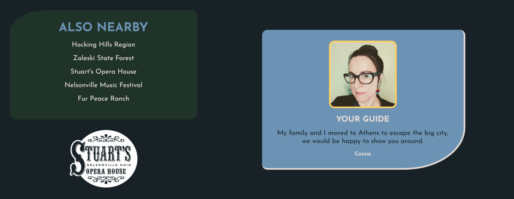

## Table of contents

- [Overview](#overview)
  - [The challenge](#the-challenge)
  - [Screenshot](#screenshot)
  - [Links](#links)
- [My process](#my-process)
  - [Built with](#built-with)
  - [What I learned](#what-i-learned)
  - [Continued development](#continued-development)
  - [Useful resources](#useful-resources)
- [Author](#author)
- [Acknowledgments](#acknowledgments)


### THe challenge

[Scrimba M2 Solo Project: Hometown Homepage](https://scrimba.com/learn/frontend/solo-project-hometown-homepage-cob2e4812840974342ebb42eb)

[Figma file](https://www.figma.com/file/2QuGfAOcHaZJ6aHXfuamnK/Hometown-Homepage?node-id=0%3A1)

Requirements:
 - build from "scratch"
 - classes
 - flexbox
 - background-image
 - color palette

 Stretch goals: COMPLETED
 - make it about your own hometown, country, or whatever you like: Athens, Ohio
 - use a different color palette: [My Color Palette](https://coolors.co/182226-3c543c-1f3329-6c93b4-e2dad7)
 - add a Google Font: [Josefin Sans](https://fonts.google.com/specimen/Josefin+Sans)
 - find a way to use :hover: all of my links have a hover pseudo-class

 ```css
  a {
    color: var(--timberwolf);
    text-decoration: none;
}

  a:visited {
    color: var(--timberwolf);
}

  a:hover {
    color: var(--maize-crayola);
}
 ```
 - add a whole new section: I an added "Also Nearby" section, and used flexbox to put it next to "Your Guide"
 

### Links

- My Scrim: [My Scrim](https://scrimba.com/scrim/coaa049d8847bd822da0c5fc2)
- Github Repository: [Github](https://github.com/casserole27/hometown-homepage)
- Live Site URL: [live site](https://casserole27.github.io/hometown-homepage/)

## My process

Create Github repository
- initialize README

Setup basic HTML file 
- insert my personal comment credit
- head tag includes stylesheet/link and fonts, double check for meta viewport tag
- initial semantic, accessible markup: placing main, heading and paragraph tags
 - commit and push

Setup basic CSS file
- insert my personal comment credit
- decide on mobile or desktop-first design based on design file examples
- set up root selector with variables: colors, border radius, and font size
- margin, padding, box-size reset, root
- decide on global styles
- commit and push

Consult Figma design files
 - use rems or ems
 - adjust text properties: size, line height, color
 - insert images and color properties
 - decide on layout tools and markup accordingly
 - add effects: borders, box shadows, etc
 - commit and push after each major change

Publish live URL

Check markup and accessibility
(https://validator.w3.org/)
(https://wave.webaim.org/)
 - make adjustments as necessary
 - commit and push
 - finish README


### Built with

- Semantic HTML5 markup
- CSS custom properties
- Flexbox
- Responsive Web Design

### What I learned

Personal stretch goal: curved borders 
I learned that the border radius selector can utilize a clockwise shorthand similar to margin and padding, and I learned about the selector for each corner of the border. You can use this to make the box it is applied to into more of a shape.

```css
    border-radius: 1rem 1rem 40% 1rem;
    /* border-radius: var(--br-round); */
    /* border-bottom-right-radius: 40%; */


    border-radius: 40% 1rem;
    /* border-radius: var(--br-soft); */
    /* border-top-left-radius: 40%; */
    /* border-bottom-right-radius: 40%; */
```

Personal stretch goal: responsiveness
I learned a lot about making flexbox responsive. This may have been easier with grid, but I wanted to stick to the assignment. I have a breakpoint of 40rem between a mobile and desktop screen, and I made most of the components "squishy." For example, this condensed bit of the CSS contains the selectors that would make the activity section responsive.

```css
.activity-section {
    background-color: var(--hunter-green);
    text-align: center;
    /* FLEXBOX FOR IMAGES AND TEXT */
    display: flex;
    flex-direction: row;
    justify-content: space-around;
    gap: 1rem;
    margin-bottom: 2rem;
}


.activity-block {
    width: 18rem;
    margin: 1rem;
}

.activity-img {
    width: 100%;
 }

.activity-subtitle, .activity-text {
    width: 100%;

}
```

Each section has a media query, and some of them switch the flex direction to column at the breakpoint. It looks better, instead of trying to squish the images on a horizontal line at 300-450px.

```css
@media (max-width: 40rem) {
    .activity-section {
    flex-direction: column;
    align-items: center;
    }

    .activity-block {
        padding: 0 2rem;
    }

    .activity-title {
        font-size: var(--fs-s);
    }

 } 
```

### Continued development

I began the M2 Inspirational Quotes page, and I want to continue what I learned here as well as what I learn about JavaScript once I begin and complete M3. 

### Useful resources

[MDN Webdoc for border radius](https://developer.mozilla.org/en-US/docs/Web/CSS/border-radius)


## Author

- Website - [C Lewis](https://www.clewisdev.com)
- LinkedIn - [LinkedIn](https://www.linkedin.com/in/clewisdev/)


## Acknowledgments

[Kevin Powell's YouTube channel](https://www.youtube.com/kepowob)


